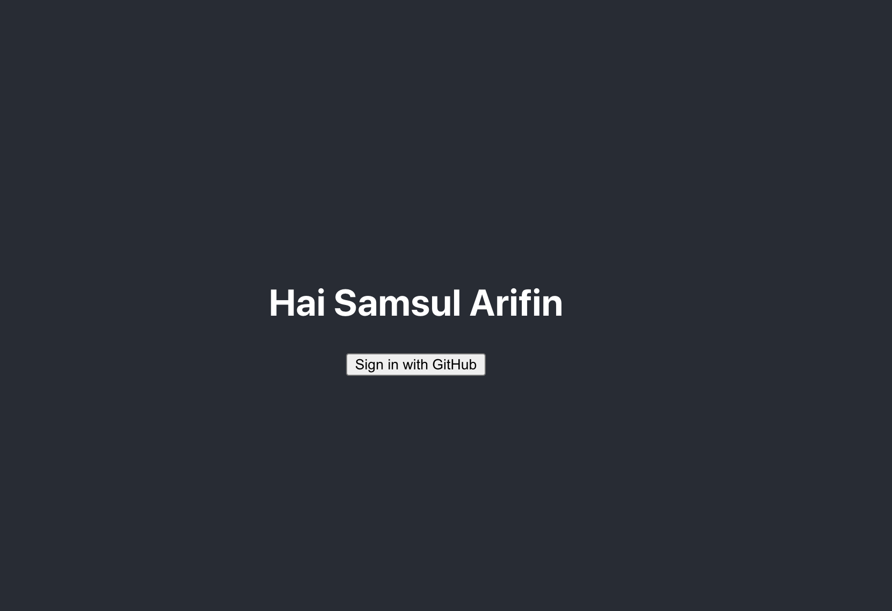

## Expected

## Issue yang ditemukan:

- Tidak dapat menemukan pencarian di github (walaupun username, repo, dsb) yang
  dicari ada, terjadi karena proses login gagal disebabkan tidak ada clientId
  dan redirectUri (BIsa dilihat pada URL popup yang muncul yakni
  https://github.com/login/oauth/authorize?client_id==&scope==user:email&redirect_uri==,
  memperlihatkan param client_id dan redirect_uri nya kosong). Pada url popup
  juga key param dan value paramnya dipisahkan dengan tanda **==**, yang
  seharusnya adalah **=**. Untuk mendapatkan clientId, maka
  1. pada akun github, plih Setting-> Developer setting -> OAuth Apps ->
     Register new application
  2. Select Applications > Developer applications tab.
  3. Kemudian setelah register akan dapat Client ID,Client Secret, serta
     redirect_uri yang kita setting
- Selanjutnya, passing clientId ke component GithubLogin melalui props
  **clientId**, dan redirect_uri melalui props **redirectUri**
- Terdapat typo pada utils.js **let query = `${str}${key}==${params[key]}`;**
  harusnya **et query = `${str}${key}=${params[key]}`;**, hal ini menyebabkan
  URL pada popup menjadi
  *https://github.com/login/oauth/authorize?client_id==&scope==user:email&redirect_uri==*
  atau yang telah disebutkan pada point pertama sebelumnya.
- error pada CROSS ORIGIN, setelah dilihat ternyata perlu ditambahkan Client
  Secret pada saat request akses token (method onGetAccessToken pada component
  GithubLogin)

Note : Masih ada masalah yang masih perlu didebug
